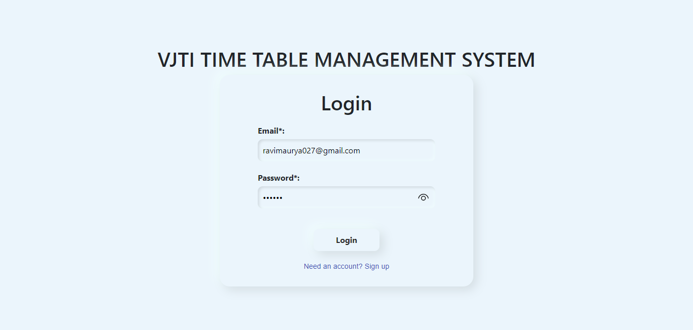
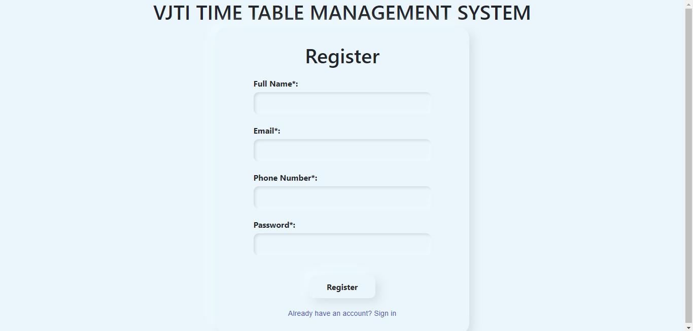
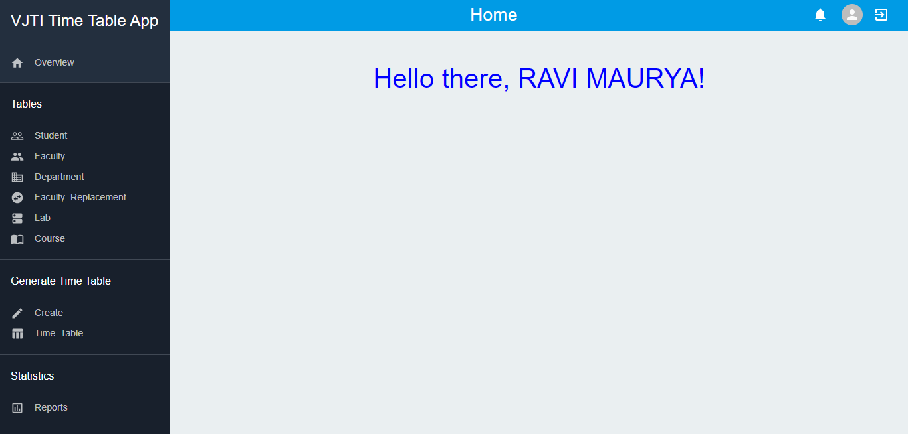
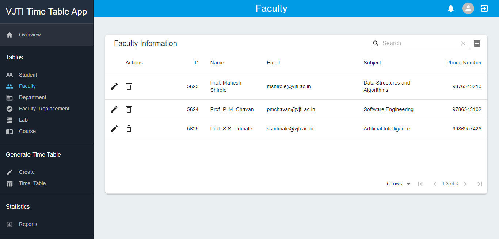
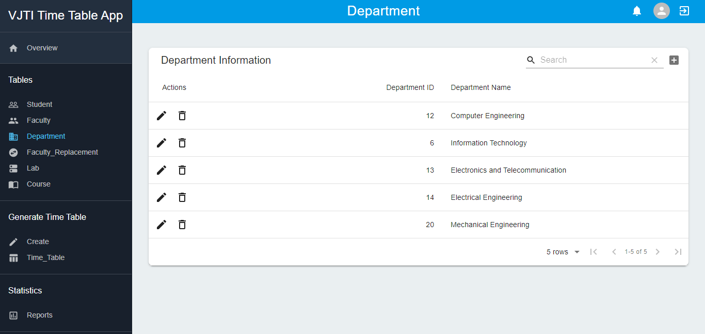
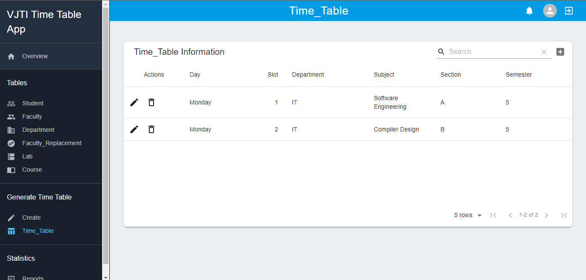
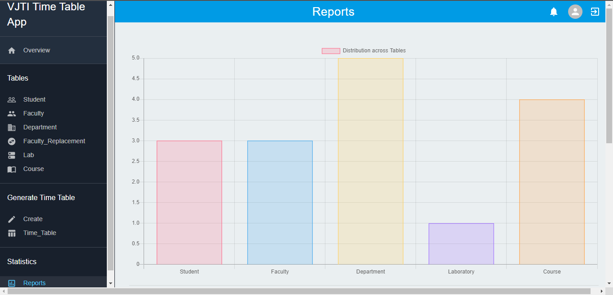

# Time Table Management System


### Group 8

- 201081057 - Sarrah Bastawala
- 201080048 - Himanshu Chougule

---

- [Time Table Management System](#time-table-management-system)
  - [Screenshots](#screenshots)
    - [Login Screen](#login-screen)
    - [Registeration Screen](#registeration-screen)
    - [Homepage](#homepage)
    - [Faculty Screen](#faculty-screen)
    - [Department list](#department-list)
    - [Time table View](#time-table-view)
    - [Report](#report)
  - [File Structure](#file-structure)
  - [Functions](#functions)
    - [Admin](#admin)
    - [Faculty](#faculty)
    - [Student](#student)
- [How To Run This Project](#how-to-run-this-project)
  - [To Get This Code On Your Local Computer:](#to-get-this-code-on-your-local-computer)
  - [Running The Code](#running-the-code)
    - [Front End - REACTJS](#front-end---reactjs)
    - [Backend - NODEJS](#backend---nodejs)
- [Available Scripts](#available-scrips)
  - [1. `npm start`](#1-npm-start)
  - [2. `npm test`](#2-npm-test)
  - [3. `npm run build`](#3-npm-run-build)
  - [4. `npm run eject`](#4-npm-run-eject)

---

## Screenshots

### Login Screen



### Registeration Screen



### Homepage



### Faculty Screen



### Department list



### Time table View



### Report



---

## File Structure

```

📂assets                # Contains all the images regarding the project
📂public                # Contains the public resources for the web app
┣ 📜favicon.ico
┣ 📜index.html
┣ 📜logo192.png
┣ 📜logo512.png
┣ 📜manifest.json
┗ 📜robots.txt
📂server                # Contains the backend code for the web app
┣ 📂genetic-algorithm
┃ ┣ 📜crossover.js
┃ ┣ 📜fitness.js
┃ ┣ 📜helpers.js
┃ ┣ 📜index.js
┃ ┣ 📜mutate.js
┃ ┗ 📜seed.js
┣ 📂tests
┃ ┣ 📜crossover.test.js
┃ ┣ 📜fitness.test.js
┃ ┣ 📜helpers.test.js
┃ ┣ 📜minCollisions.test.js
┃ ┣ 📜mutate.test.js
┃ ┗ 📜seed.test.js
┣ 📜package-lock.json
┣ 📜package.json
┗ 📜server.js
📂src                   # Contains all the frontend code for the web app
┣ 📂components
┃ ┣ 📂LandingPage
┃ ┃ ┣ 📜Header.js
┃ ┃ ┣ 📜Navigator.js
┃ ┃ ┣ 📜Paperbase.js
┃ ┃ ┗ 📜tabledata.js
┃ ┣ 📂TimeTable
┃ ┃ ┣ 📜time.js
┃ ┃ ┗ 📜TimeTableSelect.js
┃ ┣ 📜CreateNew.js
┃ ┣ 📜Graph.js
┃ ┣ 📜Home.js
┃ ┣ 📜InputField.js
┃ ┣ 📜Login.css
┃ ┣ 📜Login.js
┃ ┣ 📜Register.js
┃ ┗ 📜Table.js
┣ 📜App.css
┣ 📜App.js
┣ 📜App.test.js
┣ 📜index.css
┣ 📜index.js
┣ 📜logo.svg
┣ 📜serviceWorker.js
┗ 📜setupTests.js
┣ 📜.gitignore
┣ 📜package-lock.json
┣ 📜package.json
┗ 📜README.md           # Contains the description of the project
```

---

## Functions

### Admin

- After login, the admin can view the students details, faculty details, and also manage the departments.
- Admin can view, update, delete the student details.
- Admin can view, update, delete the teacher details.
- Admin can manage the departments and semester accordingly.
- Admin fills up the details for the semester, courses, branches etc. the genetic algorithm is used to generate a time table.
- Time tables also contains the details for the labs.

### Faculty

- Faculty needs to login using their credentials for their access.
- Faculty can view the time table generated by the system.
- They also have access to the student details.
- Faculty can request the admin for specific change in time table.

### Student

- Student needs to login using credentials to access the time table.
- Student can view the time table generate by the systems.
- There's also a seperate section to view the lab time table.
- Students can also download the timetable for their future reference.

---

# How To Run This Project

## To Get This Code On Your Local Computer:

1. Download the latest LTS version of [NodeJS](https://nodejs.org/en/)
2. Download the ZIP file to your local computer
3. Go to the project directory and run `npm install` to install the client dependencies.
4. Go to server directory and run `npm install`

## Running The Code

### Frontend - REACTJS
1. In the main project directory, run `npm install`
2. Then run `npm start`
3. Client server will start running on port 3000

### Backend - NODEJS:

1. Go to the server directory
2. Run node server.js
3. LOCALHOST server will be running on port port

---

# Available Scripts

In the project directory, you can run:

### 1. `npm start`

Runs the app in the development mode.<br />
Open [http://localhost:3000](http://localhost:3000) to view it in the browser.

The page will reload if you make edits.<br />
You will also see any lint errors in the console.

### 2. `npm test`

Launches the test runner in the interactive watch mode.<br />
See the section about [running tests](https://facebook.github.io/create-react-app/docs/running-tests) for more information.

### 3. `npm run build`

Builds the app for production to the `build` folder.<br />
It correctly bundles React in production mode and optimizes the build for the best performance.

The build is minified and the filenames include the hashes.<br />
Your app is ready to be deployed!

See the section about [deployment](https://facebook.github.io/create-react-app/docs/deployment) for more information.

### 4. `npm run eject`

**Note: this is a one-way operation. Once you `eject`, you can’t go back!**

If you aren’t satisfied with the build tool and configuration choices, you can `eject` at any time. This command will remove the single build dependency from your project.

Instead, it will copy all the configuration files and the transitive dependencies (webpack, Babel, ESLint, etc) right into your project so you have full control over them. All of the commands except `eject` will still work, but they will point to the copied scripts so you can tweak them. At this point you’re on your own.

You don’t have to ever use `eject`. The curated feature set is suitable for small and middle deployments, and you shouldn’t feel obligated to use this feature. However we understand that this tool wouldn’t be useful if you couldn’t customize it when you are ready for it.